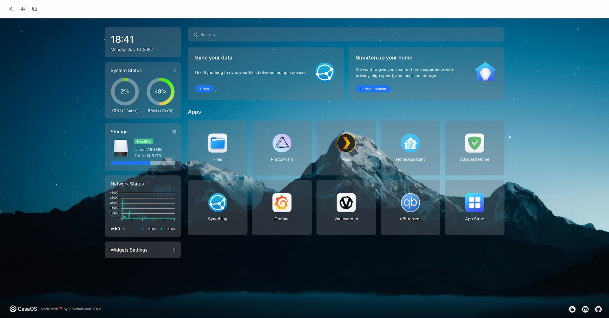

# CasaOS - Your Home Cloud OS


<!-- Readme i18n links -->
<!-- > English | [中文](#) | [Français](#) -->

<p align="center">
    <!-- CasaOS Banner -->
    <picture>
        <source media="(prefers-color-scheme: dark)" srcset="https://raw.githubusercontent.com/IceWhaleTech/logo/main/casaos/casaos_banner_dark_night_800px.png">
        <source media="(prefers-color-scheme: light)" srcset="https://raw.githubusercontent.com/IceWhaleTech/logo/main/casaos/casaos_banner_twilight_blue_800px.png">
        
    </picture>
    <br/>
    <i>Connect with the community developing HOME CLOUD, creating self-sovereign, and defining the future of the distributed cloud.</i>
    <br/>
    <br/>
    <!-- CasaOS Badges -->
    <a href="https://github.com/IceWhaleTech/CasaOS" target="_blank">
        
    </a>
    <a href="https://github.com/IceWhaleTech/CasaOS/blob/main/LICENSE" target="_blank">
        
    </a>
    <a href="https://github.com/IceWhaleTech/CasaOS/pulls" target="_blank">
        
    </a>
    <a href="https://github.com/IceWhaleTech/CasaOS/issues" target="_blank">
        
    </a>
    <a href="https://github.com/IceWhaleTech/CasaOS/stargazers" target="_blank">
        
    </a>
    <!-- <a href="https://github.com/IceWhaleTech/CasaOS/releases" target="_blank">
    
    </a> -->
    <br/>
    <!-- CasaOS Community -->
    <a href="https://discord.gg/knqAbbBbeX" target="_blank">
        
    </a>
    <a href="https://github.com/IceWhaleTech/CasaOS/discussions" target="_blank">
        
    </a>
<!-- ALL-CONTRIBUTORS-BADGE:START - Do not remove or modify this section -->
<a href="#credits"></a>
<!-- ALL-CONTRIBUTORS-BADGE:END -->
    <br/>
    <!-- CasaOS Links -->
    <a href="https://www.casaos.io" target="_blank">Website</a> |
    <a href="http://demo.casaos.io" target="_blank">Demo</a> |
    <a href="https://github.com/IceWhaleTech/CasaOS" target="_blank">GitHub</a>
    <br/>
    <br/>
    <!-- CasaOS Snapshots -->
    <kbd>
      <picture>
          <source media="(prefers-color-scheme: dark)" srcset="snapshot-dark.jpg">
          <source media="(prefers-color-scheme: light)" srcset="snapshot-light.jpg">
          
      </picture>
    </kbd>
</p>

## Why do we need Home Cloud?

Think about it seriously. Is control of our data, smart devices and digital assets now only in the hands of some big company?

- Is your photo album saved in their cloud service?
- Do your thermostats, monitors, lamps need to be used through their cloud services?
- Do your personal documents, memos, contacts, passwords, etc. reside in their cloud storage services?
- Are you just going to have to accept their decisions when they decide to change prices, review content or even discontinue services?

It sounds ridiculous, doesn't it? We are losing control of our own data!

Our ideal home cloud is one where you can manage all your data, devices and data assets very easily. In your own home, you have absolute control.

> If you think what we are doing is valuable. Please **give us a star ⭐** and **fork it 🤞**!

## Features

- Friendly UI designed for home scenarios
  - No code, no forms, intuitive, design for humanity
- Multiple hardware and base system support
  - ZimaBoard, NUC, RPi, old computers, whatever is available.
- Selected apps in the app store, one-click installation
  - Nextcloud, HomeAssiant, AdGuard, Jellyfin, *arr and more!
- Easily install numerous Docker apps
  - Over 100,000 apps from the Docker ecosystem can be easily installed
- Elegant drive and file management
  - What you see is what you get. No technical background required.
- Well-designed system/app widgets
  - What you care about, at a glance. Resource usage, app status, and more!

## Getting Started

CasaOS fully supports ZimaBoard, Intel NUC, and Raspberry Pi. Also, more computers and development boards and fully compatible with Ubuntu, Debian, Raspberry Pi OS, and CentOS with one-liner installation.

### Hardware Compatibility

- amd64 / x86-64
- arm64
- armv7

### System Compatibility

Official Support
- Debian 11 (✅ Tested, Recommended)
- Ubuntu Server 20.04 (✅ Tested)
- Raspberry Pi OS (✅ Tested)

Community Support
- Elementary 6.1 (✅ Tested)
- Armbian 22.04 (✅ Tested)
- Alpine (🚧 Not Fully Tested Yet)
- OpenWrt (🚧 Not Fully Tested Yet)

### Quick Setup CasaOS

Freshly install a system from the list above and run this command:

```sh
wget -qO- https://get.casaos.io | bash
```

or

```sh
curl -fsSL https://get.casaos.io | bash
```

### Uninstall CasaOS


v0.3.3 or newer

```sh
casaos-uninstall
```

Before v0.3.3

```sh
curl -fsSL https://get.icewhale.io/casaos-uninstall.sh | bash
```

## Community 

The word Casa comes from the Spanish word for "home". Project CasaOS originated as a pre-installed system for crowdfunded product [ZimaBoard](https://www.zimaboard.com) on Kickstarter.

After looking at many systems and software on the market, the team found no server system designed for home scenarios, sadly true.

So, we set out to build this open source project to develop CasaOS with our own hands, everyone in the community, and you.

We believes that through community-driven collaborative innovation and open communication with global developers, we can reshape the digital home experience like never before.

**A warm welcome for you to get help or share great ideas in the [Discord](https://discord.gg/knqAbbBbeX)!**

[](https://discord.gg/knqAbbBbeX)

## Contributing

CasaOS is a community-driven open source project and the people involved are CasaOS users. That means CasaOS will always need contributions from community members just like you!

<details>
  <summary><b>How can I get involved? 🧐</b></summary>
  <p>

### Coding 💻 (WIP)

We are refining documentation that can be used for effective community collaboration. Feel free to start a discussion if you have a good idea.

### Helping Users 💬

If you have extensive knowledge of CasaOS and related areas. We highly encourage you to help others as much as you can in Discord and Discussions.

Discord: [https://discord.gg/knqAbbBbeX](https://discord.gg/knqAbbBbeX)

GitHub Discussions: [https://github.com/IceWhaleTech/CasaOS/discussions](https://github.com/IceWhaleTech/CasaOS/discussions)

### Helping with Translations 🌍 (WIP)

CasaOS officially supports English and Chinese. You are welcome to help make CasaOS available in more languages.

### Performing Alpha Testing ⚠️

Alpha testing is quality assurance testing that is engaged and driven by the community. It's a great way to get involved in contributing and experiencing the latest features before a new release.

The documentation is being refined and you can contact @JohnGuan via [Discord](https://discord.gg/knqAbbBbeX). Ask to join the #casaos-alpha channel.

### Writing Documentation 📖 (WIP)

Help make our documentation better by writing new content for the CasaOS Wiki, correcting existing material, or translating content into new languages.

  </p>
</details>

## Credits

Many thanks to everyone who has helped CasaOS so far!

Everyone's contribution is greatly appreciated. ([Emoji Key](https://allcontributors.org/docs/en/emoji-key))

<!-- ALL-CONTRIBUTORS-LIST:START - Do not remove or modify this section -->
<!-- prettier-ignore-start -->
<!-- markdownlint-disable -->
<table>
  <tr>
    <td align="center"><a href="https://github.com/jerrykuku"><br /><sub><b>老竭力</b></sub></a><br /><a href="https://github.com/IceWhaleTech/CasaOS/commits?author=jerrykuku" title="Code">💻</a> <a href="https://github.com/IceWhaleTech/CasaOS/commits?author=jerrykuku" title="Documentation">📖</a> <a href="#ideas-jerrykuku" title="Ideas, Planning, & Feedback">🤔</a> <a href="#infra-jerrykuku" title="Infrastructure (Hosting, Build-Tools, etc)">🚇</a> <a href="#maintenance-jerrykuku" title="Maintenance">🚧</a> <a href="#platform-jerrykuku" title="Packaging/porting to new platform">📦</a> <a href="#question-jerrykuku" title="Answering Questions">💬</a> <a href="https://github.com/IceWhaleTech/CasaOS/pulls?q=is%3Apr+reviewed-by%3Ajerrykuku" title="Reviewed Pull Requests">👀</a></td>
    <td align="center"><a href="https://github.com/LinkLeong"><br /><sub><b>link</b></sub></a><br /><a href="https://github.com/IceWhaleTech/CasaOS/commits?author=LinkLeong" title="Code">💻</a> <a href="https://github.com/IceWhaleTech/CasaOS/commits?author=LinkLeong" title="Documentation">📖</a> <a href="#ideas-LinkLeong" title="Ideas, Planning, & Feedback">🤔</a> <a href="#infra-LinkLeong" title="Infrastructure (Hosting, Build-Tools, etc)">🚇</a> <a href="#maintenance-LinkLeong" title="Maintenance">🚧</a> <a href="#question-LinkLeong" title="Answering Questions">💬</a> <a href="https://github.com/IceWhaleTech/CasaOS/pulls?q=is%3Apr+reviewed-by%3ALinkLeong" title="Reviewed Pull Requests">👀</a></td>
    <td align="center"><a href="https://github.com/tigerinus"><br /><sub><b>Tiger Wang (王豫)</b></sub></a><br /><a href="https://github.com/IceWhaleTech/CasaOS/commits?author=tigerinus" title="Code">💻</a> <a href="https://github.com/IceWhaleTech/CasaOS/commits?author=tigerinus" title="Documentation">📖</a> <a href="#ideas-tigerinus" title="Ideas, Planning, & Feedback">🤔</a> <a href="#infra-tigerinus" title="Infrastructure (Hosting, Build-Tools, etc)">🚇</a> <a href="#maintenance-tigerinus" title="Maintenance">🚧</a> <a href="#mentoring-tigerinus" title="Mentoring">🧑‍🏫</a> <a href="#security-tigerinus" title="Security">🛡️</a> <a href="#question-tigerinus" title="Answering Questions">💬</a> <a href="https://github.com/IceWhaleTech/CasaOS/pulls?q=is%3Apr+reviewed-by%3Atigerinus" title="Reviewed Pull Requests">👀</a></td>
    <td align="center"><a href="https://github.com/Lauren-ED209"><br /><sub><b>Lauren</b></sub></a><br /><a href="#ideas-Lauren-ED209" title="Ideas, Planning, & Feedback">🤔</a> <a href="#fundingFinding-Lauren-ED209" title="Funding Finding">🔍</a> <a href="#projectManagement-Lauren-ED209" title="Project Management">📆</a> <a href="#question-Lauren-ED209" title="Answering Questions">💬</a> <a href="https://github.com/IceWhaleTech/CasaOS/commits?author=Lauren-ED209" title="Tests">⚠️</a></td>
    <td align="center"><a href="https://JohnGuan.Cn"><br /><sub><b>John Guan</b></sub></a><br /><a href="#blog-JohnGuan" title="Blogposts">📝</a> <a href="#content-JohnGuan" title="Content">🖋</a> <a href="https://github.com/IceWhaleTech/CasaOS/commits?author=JohnGuan" title="Documentation">📖</a> <a href="#ideas-JohnGuan" title="Ideas, Planning, & Feedback">🤔</a> <a href="#eventOrganizing-JohnGuan" title="Event Organizing">📋</a> <a href="#mentoring-JohnGuan" title="Mentoring">🧑‍🏫</a> <a href="#question-JohnGuan" title="Answering Questions">💬</a> <a href="https://github.com/IceWhaleTech/CasaOS/pulls?q=is%3Apr+reviewed-by%3AJohnGuan" title="Reviewed Pull Requests">👀</a></td>
    <td align="center"><a href="https://blog.tippybits.com"><br /><sub><b>David Tippett</b></sub></a><br /><a href="https://github.com/IceWhaleTech/CasaOS/commits?author=dtaivpp" title="Documentation">📖</a> <a href="#ideas-dtaivpp" title="Ideas, Planning, & Feedback">🤔</a> <a href="#question-dtaivpp" title="Answering Questions">💬</a></td>
    <td align="center"><a href="https://github.com/zarevskaya"><br /><sub><b>Skaya</b></sub></a><br /><a href="#mentoring-zarevskaya" title="Mentoring">🧑‍🏫</a> <a href="#question-zarevskaya" title="Answering Questions">💬</a> <a href="#tutorial-zarevskaya" title="Tutorials">✅</a> <a href="#translation-zarevskaya" title="Translation">🌍</a></td>
  </tr>
  <tr>
    <td align="center"><a href="https://github.com/AuthorShin"><br /><sub><b>AuthorShin</b></sub></a><br /><a href="https://github.com/IceWhaleTech/CasaOS/commits?author=AuthorShin" title="Tests">⚠️</a> <a href="https://github.com/IceWhaleTech/CasaOS/issues?q=author%3AAuthorShin" title="Bug reports">🐛</a> <a href="#question-AuthorShin" title="Answering Questions">💬</a> <a href="#ideas-AuthorShin" title="Ideas, Planning, & Feedback">🤔</a></td>
    <td align="center"><a href="https://github.com/baptiste313"><br /><sub><b>baptiste313</b></sub></a><br /><a href="#translation-baptiste313" title="Translation">🌍</a></td>
    <td align="center"><a href="https://github.com/DrMxrcy"><br /><sub><b>DrMxrcy</b></sub></a><br /><a href="https://github.com/IceWhaleTech/CasaOS/commits?author=DrMxrcy" title="Tests">⚠️</a> <a href="#ideas-DrMxrcy" title="Ideas, Planning, & Feedback">🤔</a> <a href="#question-DrMxrcy" title="Answering Questions">💬</a></td>
    <td align="center"><a href="https://github.com/Joooost"><br /><sub><b>Joooost</b></sub></a><br /><a href="#ideas-Joooost" title="Ideas, Planning, & Feedback">🤔</a></td>
    <td align="center"><a href="https://potyarkin.ml"><br /><sub><b>Vitaly Potyarkin</b></sub></a><br /><a href="#ideas-sio" title="Ideas, Planning, & Feedback">🤔</a></td>
    <td align="center"><a href="https://github.com/bearfrieze"><br /><sub><b>Bjørn Friese</b></sub></a><br /><a href="#ideas-bearfrieze" title="Ideas, Planning, & Feedback">🤔</a></td>
    <td align="center"><a href="https://github.com/Protektor-Desura"><br /><sub><b>Protektor</b></sub></a><br /><a href="https://github.com/IceWhaleTech/CasaOS/issues?q=author%3AProtektor-Desura" title="Bug reports">🐛</a> <a href="#ideas-Protektor-Desura" title="Ideas, Planning, & Feedback">🤔</a> <a href="#question-Protektor-Desura" title="Answering Questions">💬</a></td>
  </tr>
  <tr>
    <td align="center"><a href="https://github.com/llwaini"><br /><sub><b>llwaini</b></sub></a><br /><a href="#projectManagement-llwaini" title="Project Management">📆</a> <a href="https://github.com/IceWhaleTech/CasaOS/commits?author=llwaini" title="Tests">⚠️</a> <a href="#tutorial-llwaini" title="Tutorials">✅</a></td>
  </tr>
</table>

<!-- markdownlint-restore -->
<!-- prettier-ignore-end -->

<!-- ALL-CONTRIBUTORS-LIST:END -->

This project follows the [all-contributors](https://github.com/all-contributors/all-contributors) specification. Contributions of any kind welcome!

## Changelog

Detailed changes for each release are documented in the [release notes](https://github.com/IceWhaleTech/CasaOS/releases).

---

<p align="center">
    <a href="https://dashboard.trackgit.com/token/l5q8egi92tfhlxd70l2l">
        
    </a>
</p>
